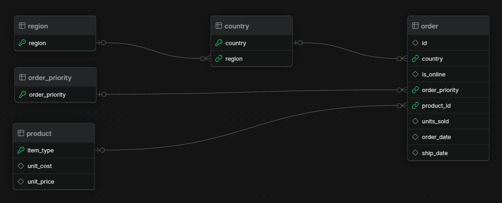

# SalesFlow: Azure-to-Snowflake Data Pipeline with Interactive Dashboard

This project demonstrates a modern data engineering workflow using Azure services, Snowflake, and a Streamlit dashboard.

It simulates a full pipeline from raw CSV to business-ready analytics — a practical showcase of my hands-on work with cloud-based data tools.

---

## 🗂️ Stack Overview

- **Azure Blob Storage** — stores raw CSV data
- **Azure Data Factory** — orchestrates ETL workflows
- **Snowflake** — cloud data warehouse for structured data
- **Streamlit + Plotly** — interactive dashboard for visual insights
- **Python** — data transformation, scripting, dashboard backend

---

## 🔄 Pipeline Flow

1. Upload [raw CSV of sales data](https://excelbianalytics.com/wp/downloads-18-sample-csv-files-data-sets-for-testing-sales/) to Azure Blob Storage
2. Use Azure Data Factory to:
   - Extract the data
   - Apply basic cleaning/transformation
   - Load into Snowflake tables
3. Query Snowflake with Python
4. Visualize data in a Streamlit dashboard

---

## 📐 Schema

---

## 📊 Streamlit Dashboard Features (Planned)

**Filters:**
- Date range
- State
- Product Category

**Charts:**
- 📈 Revenue trend over time (line chart)
- 🧑‍🤝‍🧑 Top 5 customers by spend (bar chart)
- 🌍 Revenue by state (choropleth map)

**Metrics:**
- Total revenue
- Orders count
- Avg. order value

---

## 🚧 Status

- [x] Repo initialized
- [x] Sample data upload
- [x] Snowflake schema
- [ ] ADF pipeline setup
- [ ] Dashboard MVP

---

## ✨ Why I’m Building This

I’m transitioning from a bioinformatics background into cloud data engineering. This project helps me deepen my skills in data pipelines and cloud analytics — while showcasing tools used in production-level DE workflows.
